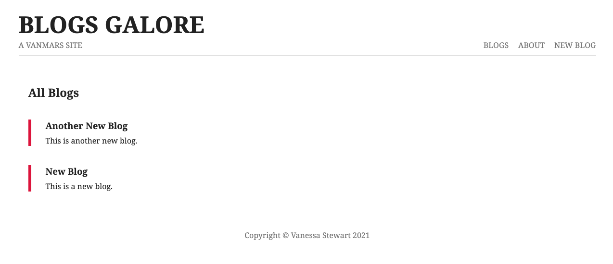

# Blog with Node.js

9 January 2021

_By: Vanessa Stewart_

### Description
This is a basic blog website to practice using MongoDB, Express.js, and Node.js to create a full-stack app.

I followed along with this tutorial [series](https://www.youtube.com/watch?v=zb3Qk8SG5Ms).